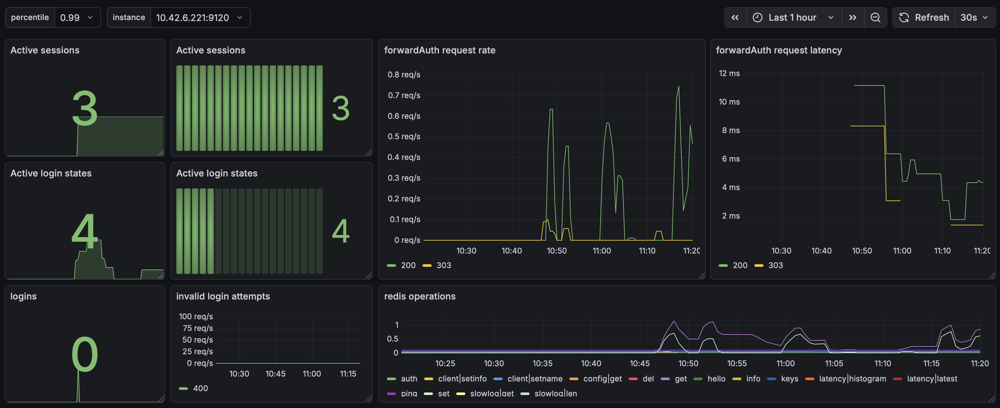

# Forward-Auth

[](https://github.com/clambin/forward-auth/releases)
[](https://app.codecov.io/gh/clambin/forward-auth)
[](https://github.com/clambin/forward-auth/actions)
[](https://github.com/clambin/forward-auth/actions)
[](https://goreportcard.com/report/github.com/clambin/forward-auth)
[](LICENSE.md)

`forward-auth` is a minimal, modern implementation of Traefik’s **forwardAuth** middleware. 
It protects your web applications with OIDC authentication and flexible authorization rules.

`forward-auth` is a rewrite of [traefik-simple-auth](https://github.com/clambin/traefik-simple-auth), 
which began as a reimplementation of Thom Seddon's [traefik-forward-auth](https://github.com/thomseddon/traefik-forward-auth).
The main differences with the original are:

- authorization rules express which user has access to which application
- session state is maintained centrally, reducing the security requirements on the browser cookie (effectively just a random ID)
- lightweight UI to manage a user's sessions

---

## Table of Contents

- [Overview](#overview)
- [How It Works](#how-it-works)
  - [High-Level Flow](#high-level-flow)
  - [Key Components](#key-components)
- [Installation](#installation)
- [Configuration](#configuration)
  - [Example Configuration](#example-configuration)
- [Identity Provider Configuration](#identity-provider-configuration)
- [Traefik Integration](#traefik-integration)
  - [Middleware](#middleware)
  - [Authentication Endpoints & Routing](#authentication-endpoints--routing)
- [Session Management](#session-management)
  - [Session Overview (UI)](#session-overview-ui)
  - [What is a Session?](#what-is-a-session)
  - [Deleting Sessions via UI](#deleting-sessions-via-ui)
  - [Logging Out](#logging-out)
  - [What Happens After Deletion?](#what-happens-after-deletion)
- [Metrics](#metrics)
- [Troubleshooting](#troubleshooting)
- [Author](#author)
- [License](#license)

---

## Overview

This service acts as an authentication and authorization gateway in front of your applications via Traefik.

```
Client ──► Traefik ──► forward-auth ──► OIDC Provider
              │
              └──► Upstream service (if authorized)
```

**Flow:**

1. Request hits Traefik
2. Traefik calls `forward-auth`
3. If user has a valid session → request is allowed
4. Otherwise → redirect to OIDC provider
5. After login → session is created and stored


---

## How It Works

The system combines **Traefik forwardAuth**, **OIDC authentication**, and **session management**.

### High-Level Flow

```
┌─────────┐      ┌─────────┐      ┌──────────────┐      ┌───────────────┐     ┌──────────────┐
│ Browser │      │ Traefik │      │ forward-auth │      │ OIDC Provider │     │ Application  │   
└────┬────┘      └────┬────┘      └──────┬───────┘      └──────┬────────┘     └──────┬───────┘
     │                │                  │                     │                     │
     │ Request        │ forwardAuth      │                     │                     │
     │───────────────►│─────────────────►│                     │                     │
     │                │                  │ No session          │                     │
     │ Redirect to OIDC provider (303)   │                     │                     │
     │◄───────────────│◄─────────────────│                     │                     │
     │                │                  │                     │                     │
     │ Call OIDC provider                │                     │                     │
     │────────────────────────────────────────────────────────►│                     │
     │                │                  │                     │                     │
     │                │                  │  User logs in       │                     │
     │◄────────────────────────────────────────────────────────│                     │
     │                │                  │                     │                     │
     │ Login callback │                  │                     │                     │
     │───────────────►│─────────────────►│                     │                     │
     │                │                  │  Get User details   │                     │
     │                │                  │────────────────────►│                     │
     │                │                  │◄────────────────────│                     │
     │                │                  │                     │                     │
     │                │                  │  Create session     │                     │
     │                │                  │  Set cookie         │                     │
     │◄───────────────│◄─────────────────│                     │                     │
     │                │                  │                     │                     │
     │ Retry request  │ forwardAuth      │                     │                     │
     │───────────────►│─────────────────►│                     │                     │
     │                │                  │                     │                     │
     │                │                  │  Validate session   │                     │
     │                │   OK (2xx)       │                     │                     │
     │                │◄─────────────────│                     │                     │
     │                │                  │                     │                     │
     │                │ Perform request  │                     │                     │
     │                │─────────────────────────────────────────────────────────────►│
```

---

### Key Components

#### forwardAuth (Traefik)

- `/api/auth/forwardauth`
- Called for every request
- Returns:
    - ✅ `2xx` → allow request
    - ❌ `303` → redirect to login
    - ❌ `403` → forbidden

#### Login Endpoint

- `/api/auth/login`
- Handles authentication callback
- Creates session
- Protects against CSRF attacks (via CSRF state token)

#### Session Store

- Stores session data (ID, user, timestamps)
- Backends:
    - `local` (in-memory)
    - `redis`

#### Session Cookie

- Stored in browser
- Contains session ID

#### Protected application(s)

- Protected by `forwardAuth` middleware
- Authenticated user accessible via `X-Forwarded-User-*` headers (email address, name, groups)

---

## Installation

Container images are available on [ghcr.io](https://ghcr.io/clambin/traefik-forward-auth). Images are available for linux/amd64 and linux/arm64.

---

## Configuration

Configuration is loaded from:

```
/etc/forward-auth/config.yaml
```

Override with:

```bash
forward-auth --config /path/to/config.yaml
```

### Example Configuration

```yaml
server:
  # HTTP server address. Default: ":8080".
  addr: :8080
  # HTTP Cookie Name. Default: "forward-auth-session".
  cookieName: forward-auth-session
  # Domain for which the cookie is valid. 
  # All protected hostnames (including auth) need to be subdomains of this domain.
  domain: .example.com

logger:
  # Logging level. Default: "info".
  level: info
  # Log format. json or text. Default: "text".
  format: json

prometheus:
  # Prometheus metrics listener. Default: ":9120".
  addr: :9120
  # prometheus metrics path. Default: "/metrics".
  path: /metrics

authn:
  # Maximum lifetime of a CSRF state token. Default: 10m.
  # Effectively, how long we wait for the user to authenticate with their OIDC provider.
  state_ttl: 10m
  # select_account determines whether the user is prompted to select an account with the OIDC provider. 
  # if true, the user is always prompted to select an account.
  # if false, the user is not prompted if already logged in at the OIDC provider.
  # Default: false.
  select_account: false
  provider:
    # OIDC provider type. oidc or github.
    type: "oidc"
    # OIDC redirect URL: OIDC redirects to this URL after the user authenticates.
    redirect_url: https://auth.example.com/api/auth/login
    # OIDC-related configuration.
    oidc:
      # OIDC client ID.
      client_id: "<client-id>"
      # OIDC client secret.
      client_secret: "<client-secret>"
      # OIDC issuer URL. Only required for type oidc.
      issuer_url: https://accounts.google.com
      # scopes to request from the OIDC provider. 
      # only override this if you know what you're doing.
      scopes: [ openid, email, profile ]
    # GitHub-related configuration. Only required for type github.
    github:
      # Oauth2 client ID.
      client_id: "<client-id>"
      # Oauth2 client secret.
      client_secret: "<client-secret>"
      # scopes to request from github. 
      # only override this if you know what you're doing.
      scopes: [ user:email, read:user ]

authz:
  # Authorization rules. A request is allowed if it matches at least one rule.
  # If a rule contains both users and groups, the rule is allowed if the user matches either list.
  rules:
    - domain: "*.example.com"
      users:
        - user@example.com
    - domain: admin.example.com
      groups:
        - admins
  groups:
    - name: admins
      users:
        - admin@example.com

storage:
  # Session and CSRF state storage type. local or redis. Default: "local".
  type: redis
  # Redis configuration.
  redis:
    addr: redis:6379
    username: "redis-username"
    password: "redis-password"
    db: 0

session:
  # Session lifetime. Default: 24h. 
  # Session is deleted after this time.
  session_ttl: 24h
```

---

## Identity Provider Configuration

`forward-auth` relies on an external identity provider to authenticate users.
Currently, we support the following providers:

- OIDC
- GitHub

Only one provider is supported at a time. 

Once the provider has been configured, add the relevant information in the authn.provider section in the configuration file:
type, client_id, client_secret, issuer_url (only applicable for oidc) and redirect_url.

Detailed instructions for each provider are available in [PROVIDERS.md](PROVIDERS.md).

Configure your provider with:

```
https://auth.example.com/api/auth/login
```

---

## Traefik Integration

### Middleware

```yaml
apiVersion: traefik.io/v1alpha1
kind: Middleware
metadata:
  name: forward-auth
spec:
  forwardAuth:
    address: http://forward-auth:8080/api/auth/forwardauth
    trustForwardHeader: true
    authResponseHeaders:
      - X-Forwarded-User-Email
      - X-Forwarded-User-Name
      - X-Forwarded-User-Groups
```

---

### Authentication Endpoints & Routing

You must expose `forward-auth` via Traefik for browser-based login.

#### Example HTTPRoute

```yaml
apiVersion: gateway.networking.k8s.io/v1
kind: HTTPRoute
metadata:
  name: forward-auth
spec:
  parentRefs:
    - name: traefik
  hostnames:
    - auth.example.com
  rules:
    # Login endpoint (no middleware)
    - matches:
        - path:
            type: PathPrefix
            value: /api/auth/login
      backendRefs:
        - name: forward-auth
          port: 8080

    # Everything else goes through middleware
    - matches:
        - path:
            type: PathPrefix
            value: /
      filters:
        - type: ExtensionRef
          extensionRef:
            group: traefik.io
            kind: Middleware
            name: forward-auth
      backendRefs:
        - name: forward-auth
          port: 8080
```

---

## Session Management

`forward-auth` provides basic session management capabilities, both via a UI and an HTTP API.

---

### Session Overview (UI)

The service exposes a UI where you can:

- View all active sessions
- Inspect session details (user, timestamps, etc.)
- Delete individual sessions

This UI is served by `forward-auth` itself and is **protected by the forwardAuth middleware**, meaning:

- You must be authenticated to access it
- Authorization rules (`authz.rules`) still apply

Typical access:

```
https://auth.example.com/
```

---

### What is a Session?

A session represents an authenticated user and contains:

- User identity (e.g., email)
- Last User Agent
- Last Seen timestamp

Each session is identified by a unique **session ID**, which is stored in the browser cookie:

```
Cookie: forward-auth-session=<session-id>
```

---

### Deleting Sessions via UI

From the UI, you can:

- See all active sessions
- Manually revoke sessions (e.g. logout other devices)

This is useful for:

- Security (invalidate compromised sessions)
- Administration (force logout)

---

### Logging Out

To log out a session:

1. Call the delete endpoint for that session
2. The session is removed from the store
3. Subsequent requests using that session will be rejected

For example, logging out the **current session**:

- Read the session ID from the cookie
- Call:

```bash
curl -X DELETE \
  -b "forward-auth-session=<session-id>" \
  https://auth.example.com/api/sessions/session/<session-id>
```

---

### What Happens After Deletion?

- Session is removed from storage (local or Redis)
- Cookie may still exist in the browser
- Next request:
  - Session lookup fails
  - User is redirected to the identity provider to log in again

--- 
## Metrics

| metric                        | type    | labels                | help                            |
|-------------------------------|---------|-----------------------|---------------------------------|
| forward_auth_session_count    | GAUGE   |                       | Number of active sessions       |
| forward_auth_state_count      | GAUGE   |                       | Number of active states         |
| http_request_duration_seconds | SUMMARY | code, handler, method | request duration in seconds     |
| http_requests_total           | COUNTER | code, handler, method | total requests processed        |


A sample Grafana dashboard is available [here](assets/grafana/dashboards.yaml).


---

## Troubleshooting

See [Troubleshooting](TROUBLESHOOTING.md).

---

## Author

Christophe Lambin

---

## License

[MIT License](LICENSE.md)